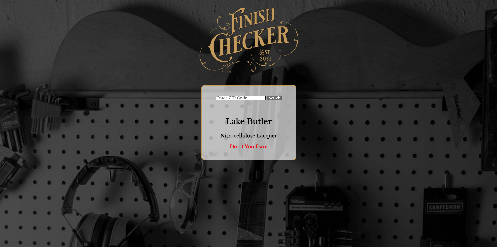

# Finish Checker;
  

  ## Deployed Project
  [Finish Checker](https://finishchecker.com/)

  ## Description 
My favorite hobby is building guitars. Like many other hobbyists, I lack constant access to a temperature controlled spray area. I wanted to create an application for myself and others that would indicate whether or not weather conditions are correct for spraying the nitrocellulose finish commonly found on guitars.

This application is built in React, with the Weather API from OpenWeather providing the up-to-date information. Finish Checker uses Geolocation to get the weather of the user's current location. If users choose to opt out of Geolocation, they may also search for their zip code.
  ## Table of Contents 

  * [Installation](#installation)
  * [Usage](#usage)
  * [License](#license)
  * [Contributing](#contributing)
  * [Contact](#contact)

  # Installation
  To run the installation, use the following code:
  npm i

  # Usage
  Create a clone of it to work on it.

  # License
  
  
  # Contributing
  Create a pull request.

  # Test
  

  # Contact
  If you have questions about anything relating to the code, please contact me at the following: 

  
  GitHub: 

  adamalcantara 

  Email 

  alcantaradevelopment@gmail.com 

  

  
